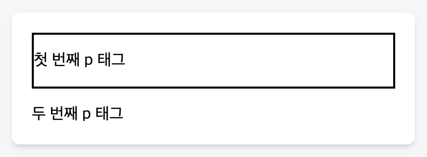
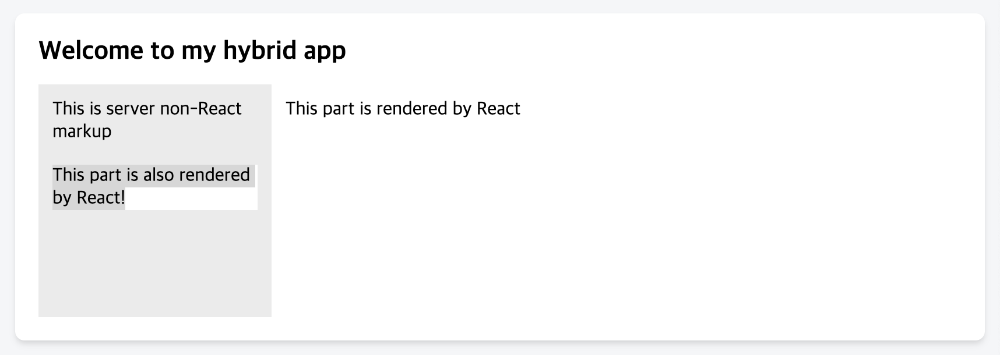
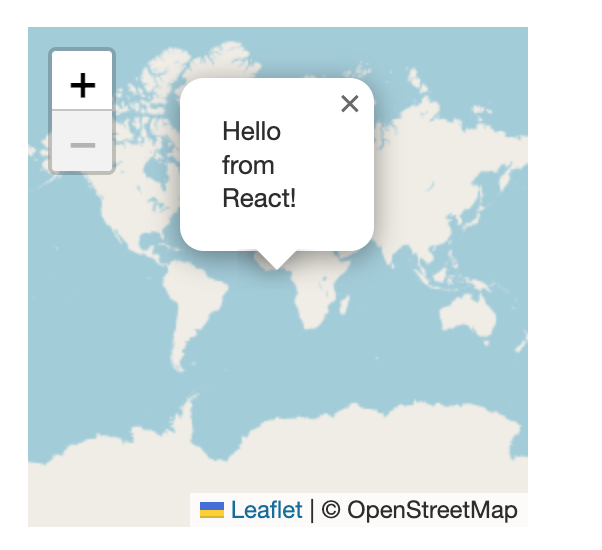

# createPortal

- cratePortal을 사용하면 일부 자식을 DOM의 다른 부분으로 렌더링할 수 있다.

```jsx
<div>
  <SomeComponent />
  {createPortal(children, domNode, key?)}
</div>
```

# Reference

```js
createPortal(children, domNode, key?)
```

- 포털을 생성하려면 createPortal을 호출하고 몇 가지 JSX와 렌더링할 DOM 노드를 전달한다.

```jsx
import { createPortal } from "react-dom";

// ...

<div>
  <p>This child is placed in the parent div.</p>
  {createPortal(
    <p>This child is placed in the document body.</p>,
    document.body
  )}
</div>;
```

- 포털은 DOM 노드의 **물리적 배치**만 변경한다.
- 다른 모든 방식에서 포털에 렌더링하는 JSX는 이를 렌더링하는 React 컴포넌트의 자식 노드 역할을 한다.
- 예를 들어, 자식은 부모 트리에서 제공하는 컨텍스트에 접근할 수 있고, 이벤트는 React 트리에 따라 자식에서 부모로 버블링된다.

## Parameters

### children

- React로 렌더링할 수 있는 모든 'JSX 조각, Fragment, string, number 또는 이들의 배열'

### domNode

- `document.getElementById()`가 반환하는 것과 같은 일부 DOM 노드
- 노드는 이미 존재하는 것이어야 한다.
- 업데이트 중에 다른 DOM 노드를 전달하면 포털 콘텐츠가 다시 생성된다.

### key (optional)

- 포털의 Key로 사용할 고유 문자열 or 숫자

## Returns

- JSX에 포함되거나 React 컴포넌트에서 반환될 수 있는 React 노드
- React가 렌더링 출력물에서 이를 발견하면, 제공된 children을 제공된 domNode 안에 배치한다.

<br/>

# 주의사항

- 포털의 이벤트는 DOM 트리가 아닌 React 트리에 따라 전파된다.
- 예를 들어, 포털 내부를 클릭했을 때 포털이 `<div onClick>`으로 감싸져 있으면 해당 `onClick` 핸들러 이벤트가 실행된다.
- 이로 인해 문제가 발생한다면, 포털 내부에서 이벤트 전파를 중지하거나 포털 자체를 React 트리에서 위로 옮겨야 한다.

<br/>

# 사용법

## 1) DOM의 다른 부분으로 렌더링하기

- 포털을 사용하면 컴포넌트가 자식 중 일부를 DOM의 다른 위치에 렌더링할 수 있다.
- 이를 통해 컴포넌트의 일부가 어떤 컨테이너에 있든 그 컨테이너에서 escape(탈출)할 수 있다.
- 예를 들어, 모달이나 툴팁을 페이지의 나머지 부분 위에 or 외부에 표시할 수 있다.
- 포털을 생성하려면 createPortal의 결과를 일부 JSX와 함께 렌더링하고 포털이 있어야 할 DOM 노드를 지정한다.
- React는 사용자가 전달한 JSX에 대한 DOM 노드를 사용자가 제공한 DOM 노드 안에 배치한다.

아래 예시에서 포털이 없다면 `두 번째 p 태그`는 테두리 있는 `<div>` 안에 배치되겠지만, 포털을 썼기 때문에 포털이 이를 `document.body`로 텔레포트시킨다.

```jsx
import { createPortal } from "react-dom";

export default function MyComponent() {
  return (
    <div style={{ border: "2px solid black" }}>
      <p>첫 번째 p 태그</p>
      {createPortal(<p>두 번째 p 태그</p>, document.body)}
    </div>
  );
}
```



### 포털은 DOM 노드의 물리적 배치만 변경한다.

- 다른 모든 면에서 포털에 렌더링하는 React 컴포넌트의 자식 노드 역할을 한다.
  - 부모 트리가 제공하는 컨텍스트에 접근 가능
  - 이벤트도 여전히 React 트리에 따라 자식에서 부모로 버블링 됨

<br/>

## 2) 모달 렌더링하기

- 모달을 불러오는 컴포넌트가 `overflow: hidden` 또는 이를 숨기는 어떤 다른 스타일이 지정되어 있더라도, 포털을 사용해서 나머지 페이지 위에 띄울 수 있다.

아래 예시에서는 모달을 방해하는 스타일이 있지만, 포털에 렌더링된 모달은 DOM에서 부모 JSX 요소에 포함되지 않기 때문에 영향을 받지 않고 잘 표시된다.

```jsx
// App
import PortalExample from './PortalExample';

export default function App() {
  return (
    <div className="clipping-container">
      <PortalExample />
    </div>
  );
}

// PortalExample
import { useState } from 'react';
import { createPortal } from 'react-dom';
import ModalContent from './ModalContent.js';

export default function PortalExample() {
  const [showModal, setShowModal] = useState(false);
  return (
    <>
      <button onClick={() => setShowModal(true)}>
        Show modal using a portal
      </button>
      {showModal && createPortal(
        <ModalContent onClose={() => setShowModal(false)} />,
        document.body
      )}
    </>
  );
}
```

### 접근성 고려

- 포털을 사용할 때 앱의 접근성을 고려하는 것이 중요하다.
  - 예를 들어, 키보드 사용자를 위해 포털 내외로 포커스를 자연스럽게 이동할 수 있도록 관리해야 한다.
    - ex) 모달 창을 사용하는 경우 사용자가 키보드만으로 모달 안팎을 자유롭게 이동할 수 있어야 한다.
    - 즉, 사용자가 포털 내의 요소와 포털 외부의 다른 요소 사이에서 키보드 탐색을 할 때, 예상대로 포커스가 이동해야 한다.
  - WHY? 스크린 리더와 같은 보조 기술을 사용하는 사람들을 위해
- 모달을 만들 때는 [WAI-ARIA 모달 제작 사례](https://www.w3.org/WAI/ARIA/apg/#dialog_modal)를 따라야 한다.
  - WAI-ARIA(Web Accessibility Initiative - Accessible Rich Internet Applications) : 장애가 있는 사용자도 더 쉽게 이해하고 사용할 수 있도록 설계된 기술 표준

## React 컴포넌트를 non-React 서버 마크업으로 렌더링하기

- 포털은 React 루트가 React로 빌드되지 않은 'static 페이지' 또는 'server-rendered 페이지'의 일부일 때 유용할 수 있다.
- 예를 들어, 페이지가 Rails와 같은 서버 프레임워크로 빌드된 경우, 사이드바와 같은 정적 영역 내에 상호작용 가능한 영역을 만들 수 있다.
- 여러 개별 React 루트를 사용하는 것과 비교하여, 포털을 사용하면 앱의 일부가 DOM의 다른 부분에 렌더링되더라도, 공유 state를 가진 단일 React 트리로 처리할 수 있다.

```jsx
// index.html
<!DOCTYPE html>
<html>
  <head><title>My app</title></head>
  <body>
    <h1>Welcome to my hybrid app</h1>
    <div class="parent">
      <div class="sidebar">
        This is server non-React markup
        <div id="sidebar-content"></div>
      </div>
      <div id="root"></div>
    </div>
  </body>
</html>


// index.js
import { StrictMode } from 'react';
import { createRoot } from 'react-dom/client';
import App from './App.js';
import './styles.css';

const root = createRoot(document.getElementById('root'));
root.render(
  <StrictMode>
    <App />
  </StrictMode>
);


// App.js
import { createPortal } from 'react-dom';

const sidebarContentEl = document.getElementById('sidebar-content');

export default function App() {
  return (
    <>
      <MainContent />
      {createPortal(
        <SidebarContent />,
        sidebarContentEl
      )}
    </>
  );
}

function MainContent() {
  return <p>This part is rendered by React</p>;
}

function SidebarContent() {
  return <p>This part is also rendered by React!</p>;
}
```



<br/>

## React 컴포넌트를 non-React DOM 노드로 렌더링하기

- React가 아닌 DOM 요소에 React 콘텐츠를 삽입할 수 있다.

React가 아닌 지도 위젯 안에 React 콘텐츠를 렌더링해보자!

1. 우선 렌더링할 DOM 노드를 저장할 state 변수를 선언한다.

   ```js
   const [popupContainer, setPopupContainer] = useState(null);
   ```

2. 지도 위젯을 생성하고, 지도에 팝업을 추가한 후 팝업 DOM 노드를 state에 저장한다.

   ```js
   useEffect(() => {
     if (mapRef.current === null) {
       const map = createMapWidget(containerRef.current); // 지도 위젯
       mapRef.current = map;
       const popupDiv = addPopupToMapWidget(map); // 팝업으로 사용될 DOM 노드를 반환 (지도 라이브러리에서 제공하는 기능)
       setPopupContainer(popupDiv);
     }
   }, []);
   ```

3. DOM 요소(popupContainer)가 준비되면 (즉, null이 아니면) 이 요소 안에 React 컴포넌트를 렌더링한다.
   ```js
   return (
     <div style={{ width: 250, height: 250 }} ref={containerRef}>
       {popupContainer !== null &&
         createPortal(<p>Hello from React!</p>, popupContainer)}
     </div>
   );
   ```


